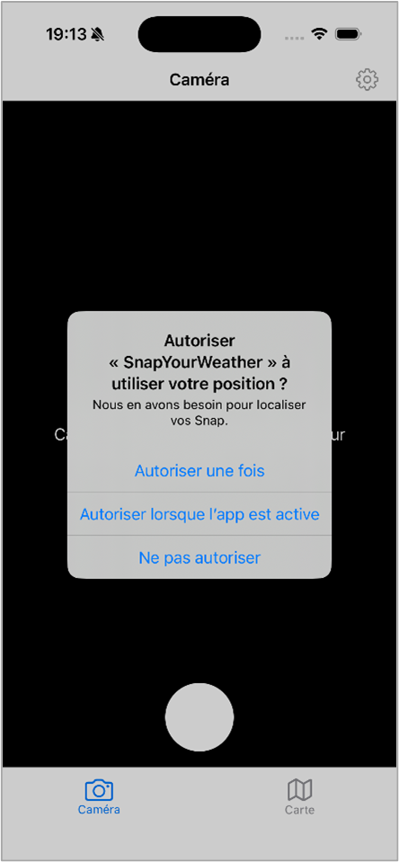
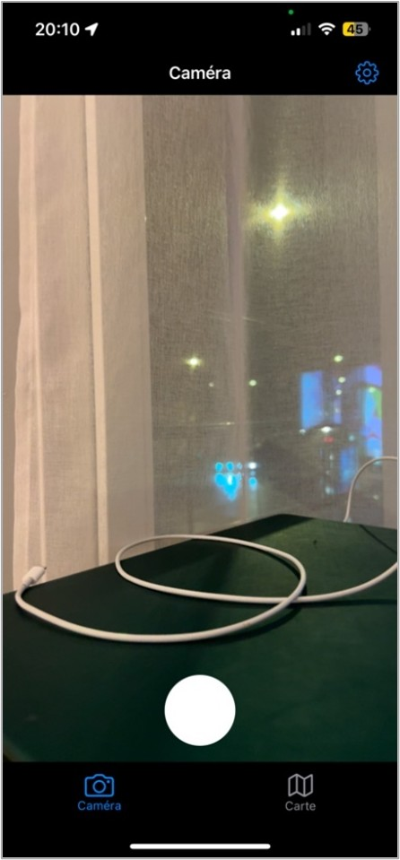
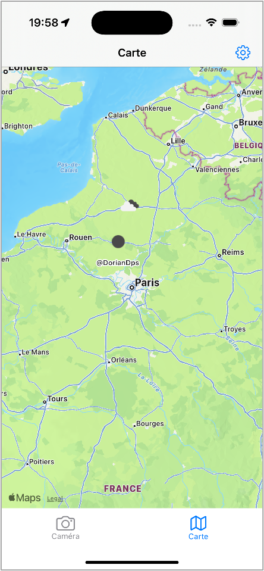
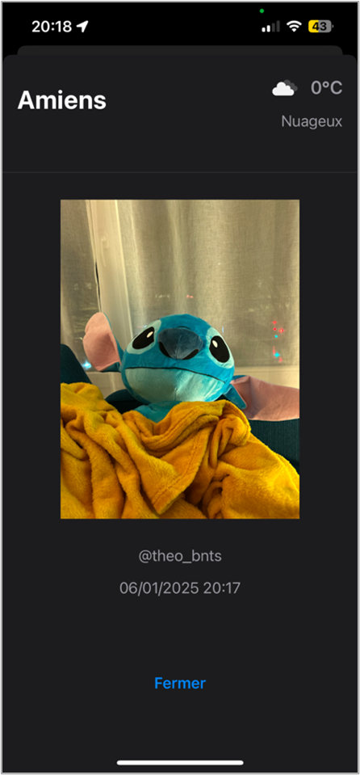

# SnapYourWeather

SnapYourWeather est une application iOS en SwiftUI qui permet à un utilisateur authentifié de :

- **Capturer** une photo avec la caméra native tout en récupérant sa géolocalisation.
- **Prévisualiser** l’image avant envoi.
- **Envoyer** la photo et ses métadonnées (coordonnées GPS et météo) vers un service web.
- **Afficher** toutes les photos publiées sur une carte interactive avec icônes météo.
- **Consulter** le détail de chaque photo (image agrandie, date, utilisateur, météo, localisation).
- **Gérer** son compte et se déconnecter.

---

## Architecture

Le projet suit le pattern **MVVM** combiné à une séparation claire des responsabilités :

```
├─ SnapYourWeatherApp.swift     # Point d’entrée de l’app
├─ EnvironmentConfig.swift      # Base URL de l’API
├─ Model/                       # Data models: User, Picture, WeatherDetails
├─ Repository/                  # UserRepository (token JWT dans UserDefaults)
├─ ViewModel/                   # AuthViewModel, PicturesViewModel
├─ Controller/                  # CameraViewController (AVFoundation + CoreLocation)
├─ Components/                  # UI réutilisables (NavigationBar, UserNameAlert)
├─ Views/                       # SwiftUI Views (Entry, SignIn, SignUp, Main, Camera, Map, Preview, Detail, Settings)
├─ Assets.xcassets/             # Couleurs et icônes d’app
└─ Preview Content/             # Ressources pour les previews SwiftUI
```

### Flux MVVM

1. **View** (ex. `CameraView`, `MapView`) interagit avec l’**Utilisateur**.
2. **ViewModel** (`AuthViewModel`, `PicturesViewModel`) orchestre les appels réseau et la transformation des données.
3. **Repository** (`UserRepository`) persiste le token JWT.
4. **CameraViewController** gère la capture photo et la localisation, puis notifie la `View` via un callback.

---

## Installation

1. **Cloner** :
   ```bash
   git clone <URL_DU_DEPOT>
   cd SnapYourWeather
   ```
2. **Ouvrir** le projet dans Xcode (macOS 12+, Xcode 14+).
3. **Configurer** la constante `EnvironmentConfig.baseURL` vers votre backend REST.
4. **Compiler et lancer** sur simulateur ou appareil iOS 15+.

---

## Détails techniques

### AuthViewModel

- Appelle l’API sur cinq endpoints (`createAccount`, `requestTemporaryCode`, `setPassword`, `getToken`, `userDetails`).
- Gère les requêtes via `performRequest`, ajoute le header `Authorization` si token présent.
- Stocke/expire le token JWT avec `UserRepository`.
- Analyse les codes HTTP pour renvoyer des messages d’erreur clairs.

### PicturesViewModel

- `getPictures()` : GET JSON ➔ décodage en `[Picture]`.
- `uploadPicture(picture:latitude:longitude:)` : PUT en `multipart/form-data` (HEIC + champs lat/long).
- Construit manuellement le corps de la requête avec un boundary unique.

### Modèles de données

- **User** : email, password, user_name.
- **Picture** : datetime (ISO8601), fileName, latitude/longitude (String), `PictureUser`, `WeatherDetails`.
  - Propriété `dateFormatted` pour afficher la date localisée.
- **WeatherDetails** : city, description, feltTemperature, icônes météo (URL).

### CameraViewController

- Configure `AVCaptureSession` et `AVCapturePhotoOutput` pour la prise de vue.
- Utilise `CLLocationManager` pour obtenir la position avant capture.
- Envoie l’image et les coords via le callback `onPhotoCaptured`.
- Ajuste l’orientation de la vidéo selon l’orientation de l’appareil.
- Prévient l’utilisateur si les permissions caméra/localisation sont refusées.

---

## Personnalisation

- **UI** : ajuster les styles dans `Components/` ou `style` dans SwiftUI.
- **API** : modifier les endpoints et les corps de requêtes dans les ViewModels.
- **Carte** : utiliser d’autres styles `MapKit` ou ajouter des overlays.

---

## Workflow visuel

1. **Inscription** : saisie de l'adresse e-mail et création du compte.  
   
2. **Autorisation de localisation** : prompt iOS pour accéder à la position.  
   
3. **Vue Caméra** : capture en temps réel via AVFoundation.  
   
4. **Capture réalisée** : image affichée avec option de prévisualisation.  
   
5. **Envoi de la photo** : bouton « Envoyer » déclenche l’upload multipart.  
   
6. **Carte interactive** : toutes les photos publiées s’affichent avec icônes météo.  
   
7. **Détail d’une photo** : affichage agrandi avec météo, date et utilisateur.  
   

---

## Auteurs

- Théo Bontemps
- Dorian Descamps
